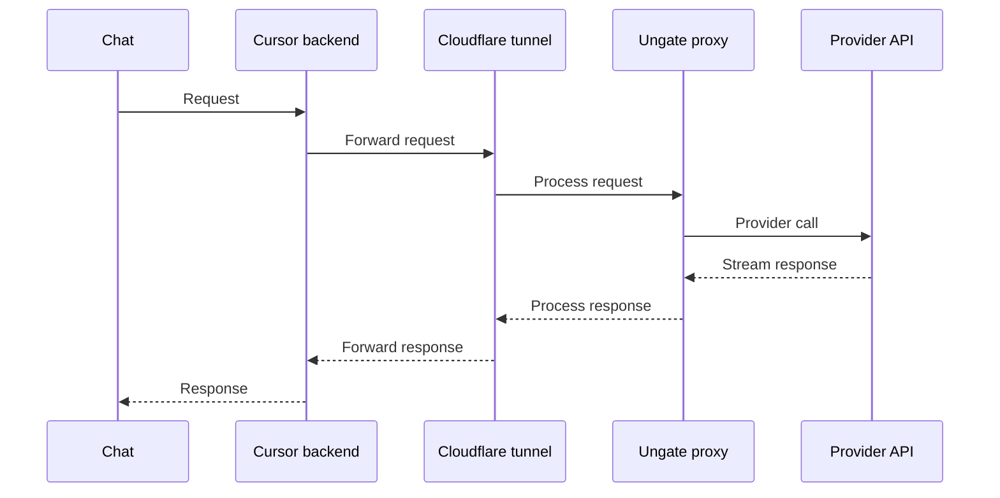

<p align="center">
  
</p>

<h3 align="center">UNN Ungate</h3>

<p align="center">
  A Cursor-first extension for using Claude, ChatGPT, MiniMax, and SuperGrok subscriptions in Cursor<br/> instead of paying for API tokens.
</p>

<p align="center">
  <a href="./LICENSE"></a>
  <a href="https://github.com/unn-corp/ungate"></a>
</p>

## How it works

Ungate lets you use Claude, ChatGPT, MiniMax, and SuperGrok in Cursor through account subscriptions instead of direct API token billing. Claude and ChatGPT authenticate via OAuth; MiniMax uses provider API credentials; Grok uses the locally signed-in Grok CLI.

Claude and ChatGPT can each retain multiple signed-in accounts. Choose the active account in its provider card; new requests use that account until you switch again. MiniMax remains a single API-key configuration. Grok uses one active SuperGrok identity managed by `grok login`; Ungate never copies or stores its OAuth tokens.

Cursor allows a custom OpenAI Base URL. Ungate listens on that URL and translates requests to the target provider API, including streaming, tool calls, and vision where supported.

The extension manages the tunnel that makes the proxy reachable to Cursor's backend and shows its settings in a Webview panel. From there you configure providers, copy the public proxy URL, and copy the proxy API key that Cursor uses to authenticate to your local proxy.

The status bar item shows separate API and tunnel state. Hover it to inspect the current tunnel URL and use quick actions for opening the dashboard, restarting the tunnel, and copying the tunnel URL.

Cursor also has a bug where `OpenAI API Key` turns itself off in settings every few hours. Ungate can keep it enabled automatically and lets you control this behavior from the status bar tooltip and the dashboard.

## Architecture



## Features

- [x] OpenAI-to-provider request translation
- [x] Streaming responses
- [x] Tool calls mapping
- [x] Image support
- [x] OAuth authentication via Claude or ChatGPT account
- [x] MiniMax API key authentication
- [x] MiniMax `<think>...</think>` reasoning separation
- [x] Request analytics
- [x] SuperGrok support through the official local Grok CLI
- [x] Analytics split by provider: Claude, OpenAI, MiniMax, and Grok
- [x] Copy-safe OpenCode local-provider configuration
- [x] Built-in web UI panel
- [x] Keeps `OpenAI API Key` enabled when Cursor turns it off on its own

## Provider support

| Capability | Claude | OpenAI | MiniMax | Grok |
| --- | --- | --- | --- | --- |
| Authentication | OAuth | OAuth | API key | SuperGrok CLI OAuth |
| Streaming | Yes | Yes | Yes | Yes |
| Agent tools | Yes | Yes | Yes | Approval-gated native tools |
| Vision | Yes | No | Yes | No |
| Analytics | Yes | Yes | Yes | Yes |

## Prerequisites

- Cursor with custom OpenAI provider support enabled.
- Node.js **22.x** installed on the machine. Ungate starts its local API through this runtime and rejects every other Node major before downloading a native dependency.
- Outbound internet access for OAuth and provider APIs.
- A reachable public tunnel URL because Cursor backend cannot call `localhost`.

## Installation

Install a VSIX from the [GitHub Releases](https://github.com/unn-corp/ungate/releases) page:

```sh
cursor --install-extension /path/to/unn-corp.ungate-1.7.6.vsix
```

Or use Cursor's Extensions panel → `...` → **Install from VSIX...**. Verify the installed extension ID is `unn-corp.ungate`.

This maintained distribution is intentionally GitHub-release only; it is not published to Open VSX or the marketplace.

### Node 22 runtime

Verify the runtime before installing the extension:

```sh
node --version # must print v22.x
```

- **Linux/macOS:** install Node 22 from <https://nodejs.org/> or use `nvm install 22 && nvm use 22`.
- **Windows:** install the Node 22 LTS `.msi` from nodejs.org, reopen Cursor, then run `node --version` in a new terminal.
- **Desktop-launch override:** set `UNGATE_NODE_BIN` to the full path of a Node 22 executable when Cursor cannot see your normal shell runtime (for example, `C:\\Program Files\\nodejs\\node.exe`). An invalid override fails explicitly; Ungate never silently chooses a different system Node.

## Setup

Install the extension, then open the dashboard by clicking the `Ungate` item in the status bar.

### Connect a Provider

Choose the provider you want to use and authenticate with it.  
For Claude and ChatGPT, sign in through OAuth.  
For MiniMax, enter your API key and choose a Base URL: `Global`, `China`, or `Custom`.
For Grok, install and sign in to the official CLI with `grok login`, then choose **Verify Grok CLI** in Ungate. The CLI's currently signed-in SuperGrok account is used; xAI API keys are deliberately not supported.

### Configure Cursor

1. In the `Tunnel` section, click `Start tunnel`, then copy the public URL shown in the panel.
2. Paste it into `Cursor Settings → Models → OpenAI Base URL`.
3. Copy the proxy API key from the same panel and paste it into `Cursor Settings → Models → OpenAI API Key`.

Quick-tunnel URLs are process-bound and change whenever you restart the tunnel. Copy the newly displayed URL to Cursor every time it changes. A Cloudflare **1033** response means the old connector is gone or stale: choose **Restart Tunnel**, wait for it to show Running, then copy the new URL into Cursor's OpenAI Base URL.

If Cursor turns `OpenAI API Key` off on its own, Ungate can turn it back on automatically. You can control this from the status bar tooltip and the dashboard.

### Add Models

1. In the `Models` section, copy the model IDs you want and add them as custom models in Cursor.
2. If you use MiniMax, add `MiniMax-M2.7` as a custom model in Cursor.
3. Select one of your custom models in Cursor and start chatting.

### Configure OpenCode

Open **Settings → OpenCode** in Ungate and copy the generated `opencode.jsonc` snippet. It points OpenCode at `http://127.0.0.1:<port>/v1`, so it does not use the Cloudflare tunnel. If proxy authentication is enabled, copy the separate `UNGATE_API_KEY` export command before starting OpenCode. Then run `/models` and select `ungate/grok-build` or another mapped Ungate model.

## Quick verification

After setup, then send one test message from Cursor using a custom model ID.

If Cursor turns `OpenAI API Key` off on its own, Ungate should turn it back on automatically.

## Known limitations

- Cursor built-in model IDs can bypass `OpenAI Base URL` and go directly to provider APIs.
- Use only custom model IDs copied from Ungate `Models` in Cursor settings.
- If Cursor still bypasses base URL, restart Cursor and re-check model selection.

## Security and privacy

- OAuth and provider credentials are stored locally on your machine.
- Request metadata for analytics is stored in the local SQLite database.
- Tunnel URL and proxy API key are secrets and should be treated like credentials.
- Anyone with both values can send requests through your proxy.
- Rotate your proxy key from the dashboard when you suspect leakage.

## Local build and install in Cursor

```sh
git clone https://github.com/unn-corp/ungate.git
cd ungate
pnpm install
pnpm run package:build
cursor --install-extension "apps/extension/out/ungate.vsix"
```

## Development

Run the build in watch mode in one step with `Command Palette -> Run Task -> build:watch all`.

Or run it manually in the terminal:

```sh
pnpm --filter @ungate/dev-kit build
pnpm --filter @ungate/shared build:watch
pnpm --filter @ungate/api build:watch
pnpm --filter @ungate/web build:watch
```

After the build, press `F5` to test the extension in Cursor debug mode.

You can also run the API separately from the extension on another port:

```sh
cd apps/api

# use the default database:
PORT=4784 node dist/main.js

# use a separate dev database:
DB_PATH=$HOME/.ungate/data-dev.db PORT=4784 node dist/main.js
```

## Troubleshooting

| Symptom | Check | Fix |
| --- | --- | --- |
| Cursor ignores base URL | Selected model is built-in | Switch to custom model ID from Ungate `Models` |
| `401` from proxy | Cursor API key field | Paste proxy API key from Ungate dashboard |
| `404` or timeout through tunnel | Tunnel status in Ungate panel | Restart tunnel from dashboard |
| Cloudflare `1033` | Tunnel URL points to a previous connector | Restart Tunnel, then copy its new URL into Cursor |
| `Unsupported Node runtime` | Node version in the Ungate output log | Install Node 22, or set `UNGATE_NODE_BIN` to a Node 22 executable |
| OAuth session expired | Provider connection status | Reconnect provider in dashboard |
| Grok CLI unavailable | Grok provider tab | Install Grok, run `grok login`, then Verify Grok CLI |
| Grok tool request paused | Cursor permission dialog | Choose Allow once or Deny; approvals never persist |
| Model missing in Cursor | Custom model list in Cursor | Add model ID manually from Ungate `Models` |

## Quick facts

- `localhost` does not work as `OpenAI Base URL` because Cursor calls the endpoint from its backend.
- Tunnel is required for Cursor backend to reach your proxy.
- Built-in provider model IDs can bypass custom base URL routing.
- Provider switch flow: connect provider in Ungate, add its model ID in Cursor, then select that custom model.
- Analytics data and API key is stored in local SQLite files under `$HOME/.ungate/`.

## License

MIT

## Support

Bug reports and feature requests: [GitHub issues](https://github.com/unn-corp/ungate/issues)

---

UNN Ungate is an MIT-licensed maintained fork of [orchidfiles/ungate](https://github.com/orchidfiles/ungate). See [UPSTREAM.md](./UPSTREAM.md) for attribution and the manual upstream-sync process.
